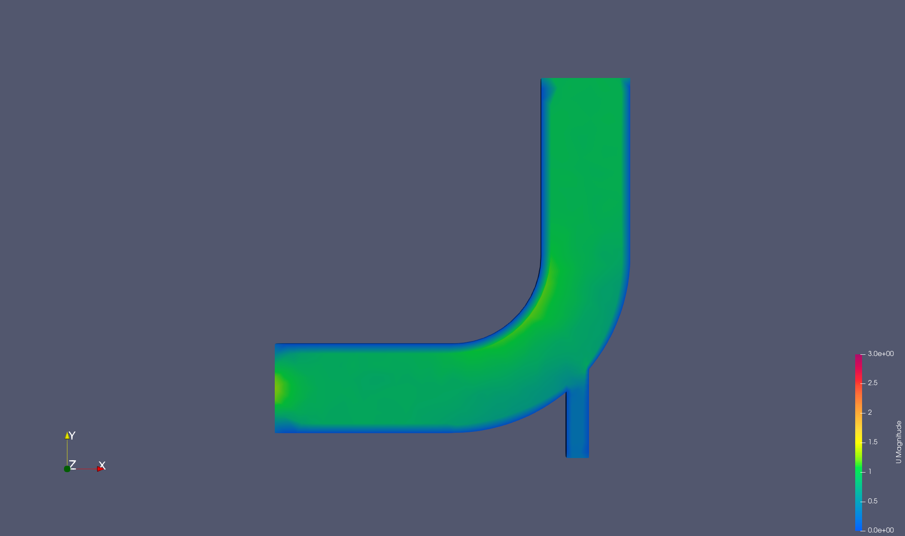
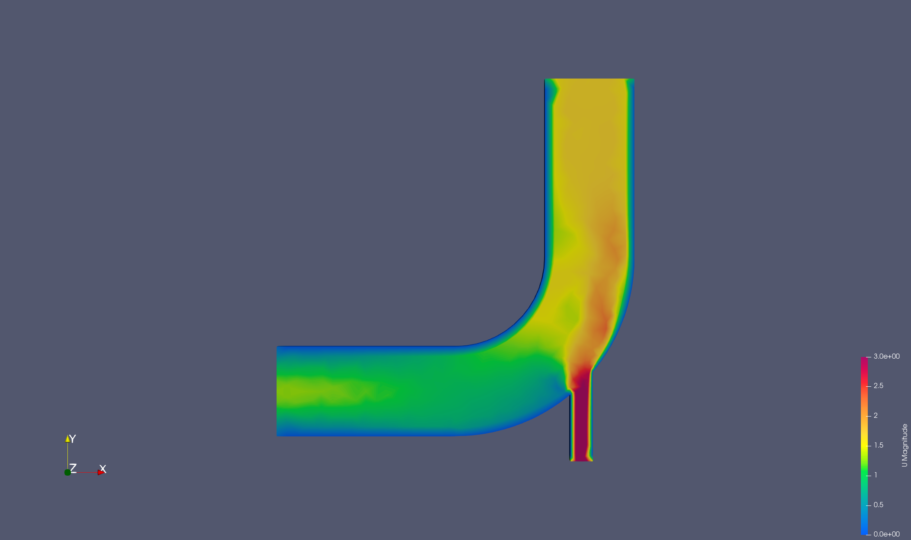
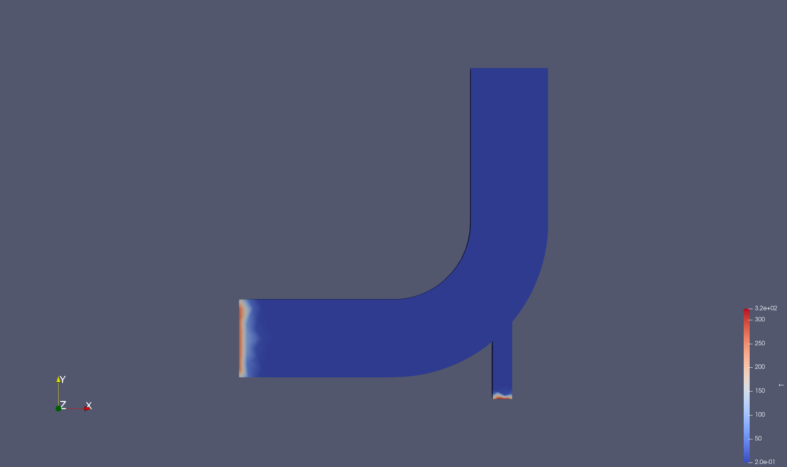
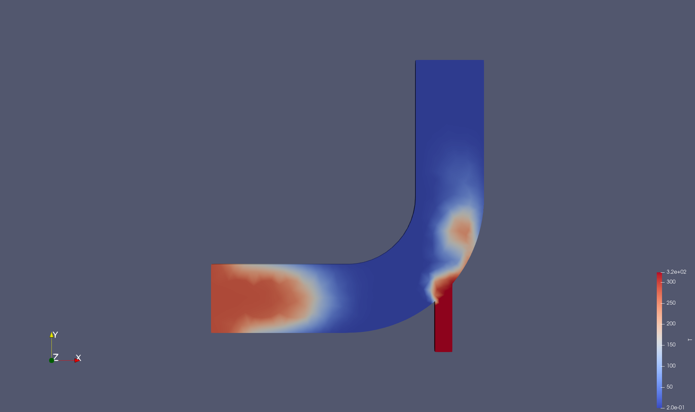
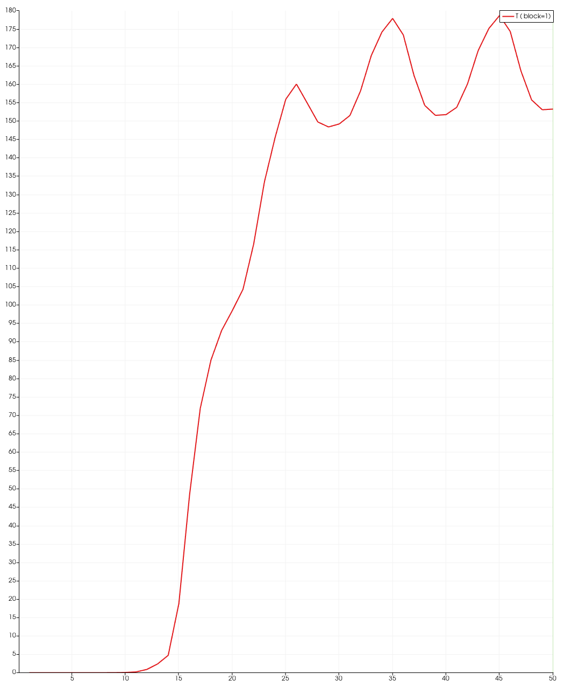
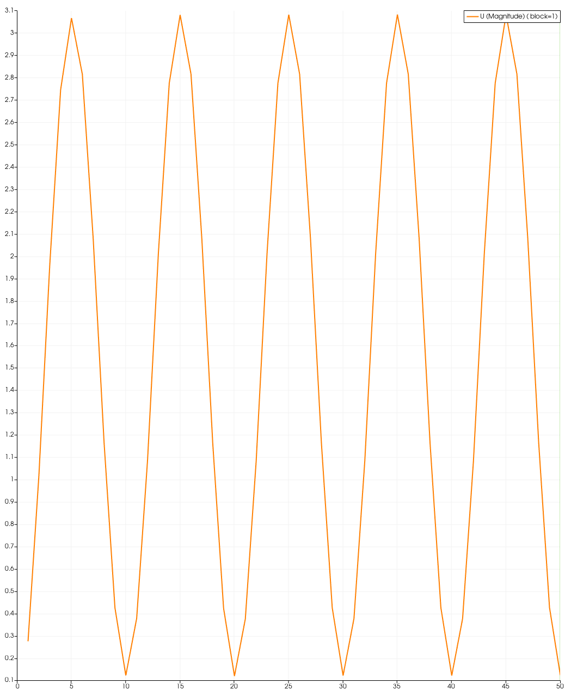

# Ticofoam
## Introduction
As part of learning [OpenFoam](https://www.openfoam.com/) and [MUI](https://github.com/MxUI/MUI), I wrote this small project to summarise everything I learnt. This project adapts the Icofoam/elbow case from the OpenFoam tutorials but adds a temperature field and coded fixed values for velocity at the inlets. In addition the Ticofoam solver is one-way coupled with a simple c++ script, "Ping.cpp", using MUI to transfer temperature values at the boundaries. There is scope to extend this in future to couple with a structural temperature sovler like [Fenics](https://fenicsproject.org/).

## Dependencies
This code uses [OpenFoam v2506](https://develop.openfoam.com/Development/openfoam/-/wikis/precompiled) and [MUI-2.0](https://github.com/MxUI/MUI). Example demos for MUI-2.0 can be found [here](https://github.com/MxUI/MUI-demo/tree/master?tab=readme-ov-file). An Openmpi installation is also needed.

## Usage
First build the customised solver using wmake. To do this source the OpenFoam environment, and then make in the ticoFoam directory.
```bash
source <OpenFoamDIR>/OpenFoam-v2506/etc/source
wmake
```
In controlDict/functions/codeOptions and controlDict/functions/codeLibs you may (probably) need to edit include flags to the correct openmpi installation.

Then to run the code use.
```bash
./Allrun
```
or to view output in a file
```bash
./Allrun > log
```
## OpenFoam
This code expands on the OpenFoam elbow tutorial found in OpenFOAM-v2506/tutorials/incompressible/icoFoam/elbow.
### Adding the temperature Field
In ticoFoam/ticoFoam.C the temperature equation has been added to the icoFoam solver so every iteration it solves the system of linear equations obtained from finite volume discretisation and calculates temperature at every cell. This sounds complicated but it amounts to a handful of lines. The temperature field and the diffusivity constant DT are declared in ticoFoam/ticoFoam.H. DT is defined in constant/transportProperties while T is defined in 0/T like the other fields.
### Boundary and Initial Conditions
These are found in 0.orig and describe the values of the pressure, temperature and velocity fields at the boundaries, as well as the initial values at t=0.
The boundaryField patch types are particularly important for the simulation and investigating what effects different types have was pretty interesting. The patch type controls the behaviour of the field at the boundary in question, for example the fixedValue type sets a constant, imposed value at the boundary and is useful for things like inlets (ie pipe opening). Another common type is ZeroGradient which sets the gradient of the field normal to the boundary to 0, essentially saying the boundary value is the internal field value, this is used for pressure at an outlet among other things. The last type used in this project is no-slip which is specific to walls and sets the velocity to 0 at the wall.

See [here](https://www.openfoam.com/documentation/user-guide/5-models-and-physical-properties/5.1-boundary-conditions) for more information on patch types.

### CodedFixedValue
CodedFixedValue is another patch type that allows you to code a value for your field at the boundary. In this project this is done twice for the velocity of flow at the inlets, see 0.orig/U.
#### Variation in time
For the smaller of the two inlets codedFixedValue is used to open and close the inlet every 10 seconds. This is done using the sin^2 function.
```cpp
code
#{
    // Access the time database
    const scalar t = this->db().time().value();
    // set the velocity in the y-direction to oscillate with time
    const vector inletVelocity = vector(0, 3.0*sqr(sin(0.31415*t)), 0);
    operator==(inletVelocity);
#};
```
#### Variation in Space
For the larger inlet codedFixed value is used to speed up the flow in the center of the flow and slow it down near the edges, this parabolic flow would be observed if the fluid had been travelling in the pipe for a long time.
```cpp
code
#{
     // get vector field of cell faces at this patch (boundary), velocity-inlet-5
    const vectorField& Cf = patch().Cf();
    //get velocity vector field
    vectorField& velo = *this;
    // iterate through cell faces at boundary
    forAll(Cf, faceI)
    {
        // access the y value and normalise it to [-1, 1] (pipe width is 16.0)
        const scalar y = (Cf[faceI].y()-8.0)/8.0;
        // set new velocity value in X-direction to follow parabolic flow
        const scalar Ux = 1.3*(1.0-y*y);
        velo[faceI] = vector(Ux, 0, 0);
    }
#};
```
### CodedFunctionObject
This part of the code can be found in system/controlDict and is responsible for reading the temperature values at the boundary and sending them to ping using MUI. Important to note here that you need to make sure that the builtin OpenFoam compiler can access all of the libraries and headers (mui and openmpi) by editing codeInclude, codeOptions and codeLibs, the latter 2 are then passed as options to g++.
## MUI
MUI is used to send the temperature values from OpenFoam to ping. ping.cpp is a simple c++ script that uses mpi to fetch values from OpenFoam and writes them to a file TempOut.txt.

On the OpenFoam side temperature values are pushed along with their corresponding location (the location isn't nessecary you could send any vector e.g (0 0 0)). 

On the ping side fetch_points and fetch_values are used along with an exact temporal_sampler to get the location and the points respectively from OpenFoam.

Once the values are fetched from the interface (and in general we know we won't need them again) it is important to forget them in order to save memory.

More examples of using MUI can be found [here](https://github.com/MxUI/MUI-demo/tree/master?tab=readme-ov-file).
## Results
Velocity at time t = 1:

Velocity at time t = 25:



Temperature at time t = 1:


Temperature at time t = 25:


Temperature at pink boundary point over time:


Velocity at inlet over time:

See TempOut.txt for temperature values at the boundary.
## Resources
1. Introduction to Fluid Mechanics: [video](https://www.youtube.com/watch?v=lJM4GuUd3Hk)
2. OpenFoam tutorial walkthroughs: [tutorial](https://www.openfoam.com/documentation/tutorial-guide)
3. OpenFoam User Guide: [docs](https://www.openfoam.com/documentation/user-guide)
4. Programming in OpenFoam and CodedFixedValue lecture: [video](https://www.youtube.com/watch?v=JNY4jozbsM8&t=1990s)
5. Adding temperature field to solver: [video](https://www.youtube.com/watch?v=SYB5nfeZ0dA), [Wiki](https://openfoamwiki.net/index.php/How_to_add_temperature_to_icoFoam)
6. MUI Overview: [video](https://www.youtube.com/watch?v=4MfeY0Dwd2Y)
7. MUI-2.0 demos: [Github](https://github.com/MxUI/MUI-demo/tree/master?tab=readme-ov-file)
8. MPI refresher: [Course](https://www.archer2.ac.uk/training/courses/200514-mpi/)
